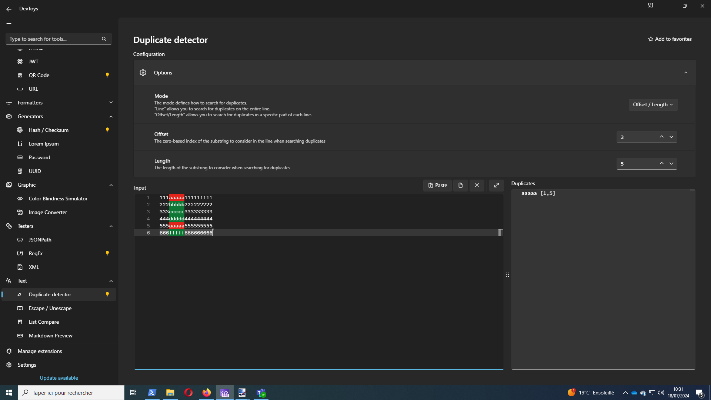

# DevToys-DuplicateDetector

DuplicateDetector is an extension for [DevToys](https://devtoys.app/) that finds duplicates in the lines of provided text.

## DuplicateDetector in DevToys GUI

### Installation

After installing DevToys, click on **Manage extensions** then on **Find more extensions online** or go to this page: [nuget.org](https://www.nuget.org/packages?q=Tags%3A%22devtoys-app%22).

A filtered list of all extensions for DevToys should appear. Locate *DuplicateDetectorExtension* and download the NuGet package.

Then, in DevToys, click on **Install extension** and select the NuGet package you downloaded.

The *DuplicateDetectorExtension* should be available after restarting DevToys.

### Usage

In GUI mode, this extension is quite straightforward. Just paste the text in the **Input zone** and the found duplicates are shown in the **Duplicate zone**. The lines of each duplicate are shown between brackets.
Additionally, the duplicates are highlighted in the input text.

DuplicateDetector has two modes: `Line` and `Offset/Length`.

#### Line Mode

This mode searches for duplicates on whole lines.

#### Offset/Length Mode

This mode allows you to configure a part of the line (with a zero-based offset and a length) to search for duplicates. In this mode, the searched part of the lines is highlighted in green, while the found duplicates are still highlighted in red.

### Removing duplicates
If duplicates are found, you have additionaly the possibility to remove them from the displayed text. Just click on the "Unduplicate" button.
You can control the way duplicates are removed in the option panel.

## DuplicateDetector in DevToys CLI 

### Installation
If you already have installed DuplicateDetector in DevToys GUI, all you have to do is to locate the plugin on your hard drive. Go to  `%localappdata%/DevToys/Plugin` or `%localappdata%/DevToys Preview/Plugin` and copy the `DuplicateDetectorExtension` folder in the plugin folder of your DevToys CLI installation.

If you are not using DevToys GUI, download the nuget package (same as GUI Installation) and unpack (this *in fine* a ZIP file) it in a new folder named `DuplicateDetectorExtension` within the plugin folder of your DevToys CLI installation.

### Usage

In CLI mode, your text you want to search duplicates on must be in a file.

#### Line mode 

`.\DevToys.CLI duplicatedetector --input "<Your File>" --mode Line`

Line mode is the default mode so you can also have the same result with this more concise way :

`.\DevToys.CLI dd -i "<Your File>"`

#### OffsetLength mode

`.\DevToys.CLI duplicatedetector --input "<Your File>" --mode OffsetLength --offset 2 --length 5`

or

`.\DevToys.CLI dd -i "<Your File>" -m OffsetLength -off 2 -len 5`

#### Removing duplicates

If the flag `--remove-duplicates` or `-rd` is set, the output will change to display original text with duplicates removed

You can control the way duplicates are removed this the option `--remove-duplicates-mode` or `-rdm` that can take the following values :
- `KeepFirstOccurence`
- `KeepLastOccurence`
- `RemoveAll`
